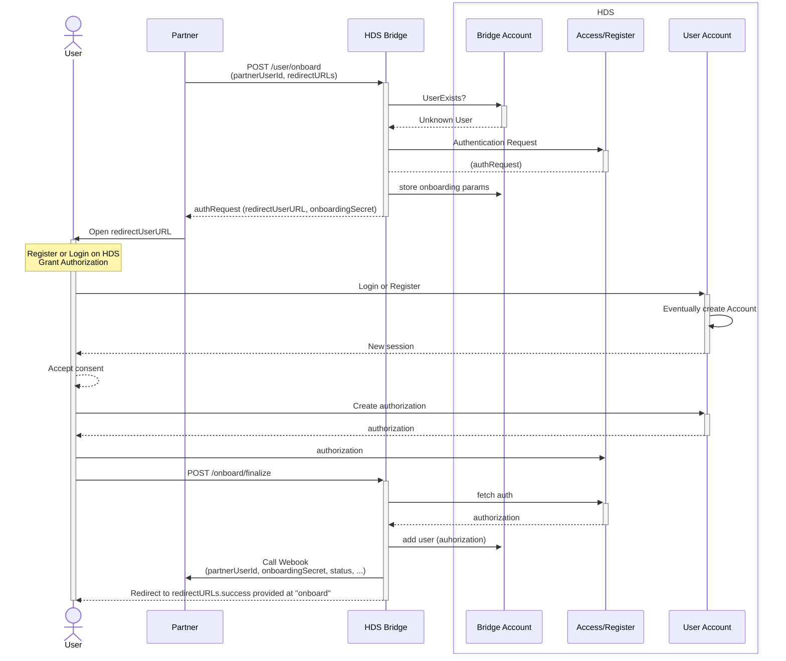

### Onboarding Detailed Flow 

Case user does not extis

```mermaid
sequenceDiagram
  actor U as User
  participant P as Partner
  participant B as HDS Bridge
  box HDS 
    participant HB as Bridge Account
    participant HA as Access/Register
    participant HU as User Account
  end

  P->>+B: POST /user/onboard<BR>(partnerUserId, redirectURLs)
  B->>+HB: UserExists?
  HB-->>-B: Unknown User
  B->>+HA:  Authentication Request
  HA-->-B: (authRequest)
  B->>+HB: store onboarding params
  B-->>-P: authRequest (redirectUserURL, onboardingSecret)
  P->>U: Open redirectUserURL
  activate U
  Note over U: Register or Login on HDS <br/> Grant Authorization
  U->>+HU: Login or Register
  HU->>HU:  Eventually create Account
  HU-->>-U: New session
  U-->>U: Accept consent
  U->>+HU: Create authorization
  HU-->>-U: authorization
  U->>HA: authorization
  U->>+B: POST /onboard/finalize 
  B->>+HA: fetch auth
  HA-->>-B: authorization
  B->>HB: add user (auhorization)
  B->>P: Call Webook<BR>(partnerUserId, onboardingSecret, status, ...) 
  B-->>-U: Redirect to redirectURLs.success provided at "onboard"
  deactivate U 
```